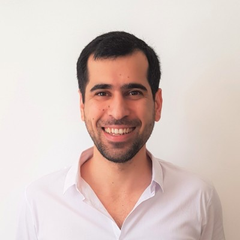

<!DOCTYPE html>
<html lang="en">
<head>
    
</head>
<body>

    
    

<h1>Guy Haim</h1>

<strong>Healthcare business expert turned biology researcher, now blending science with strategy</strong>

</body>
</html>

[LinkedIn](https://www.linkedin.com/in/guy-haim) | [GitHub](https://github.com/HaimGuy)

---

### About Me
I'm currently a PhD candidate at the [Prof. Eran Hornstein's Lab](https://www.weizmann.ac.il/molgen/hornstein/home) researching the interactions between age-differentially expressed genes and ALS genetic backgrounds.

---

### Previous Roles
- **VP of Business Development** - [AceTech](https://www.acemanan-tech.com/)
- **VP of Business Development** - [Tikkun Olam](https://tikun-olam.org.il/)
- **Board Member** - [Gynica](https://gynica.com/)

---
### Publications

---

### Connect with Me
[LinkedIn](https://www.linkedin.com/in/guy-haim) | [GitHub](https://github.com/HaimGuy)
