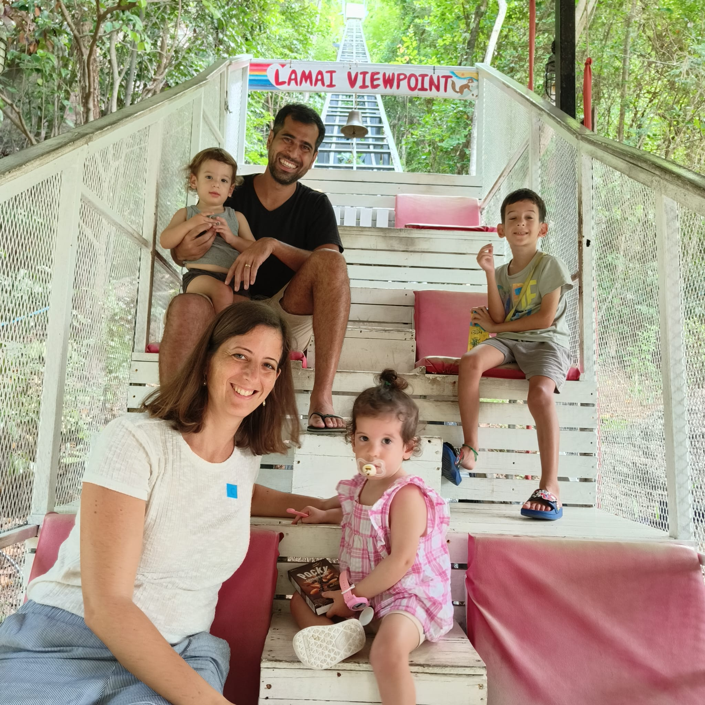

# Guy Haim

  
  

**Healthcare business expert turned biology researcher, now blending science with strategy**

[LinkedIn](https://www.linkedin.com/in/guy-haim) | [GitHub](https://github.com/HaimGuy)

---

### About Me
I'm a first year PhD student at the [Prof. Eran Hornstein's Lab](https://www.weizmann.ac.il/molgen/hornstein/home), interested in the interactions between age-differentially expressed genes and ALS genetic backgrounds.

---

### Previous Roles
- **Business Development** at [AceTech](https://www.acemanan-tech.com/)
- **Business Development** at [Tikkun Olam](https://tikun-olam.org.il/)
- **Board Member** - [Gynica](https://gynica.com/)

---

### Personal Journey
Last year, my family and I spent an unforgettable year in Phuket, Thailand. It was truly the best time of our lives, filled with adventure, cultural experiences, and lasting memories.

  
  
  

### Connect with Me
[LinkedIn](https://www.linkedin.com/in/guy-haim) | [GitHub](https://github.com/HaimGuy)
